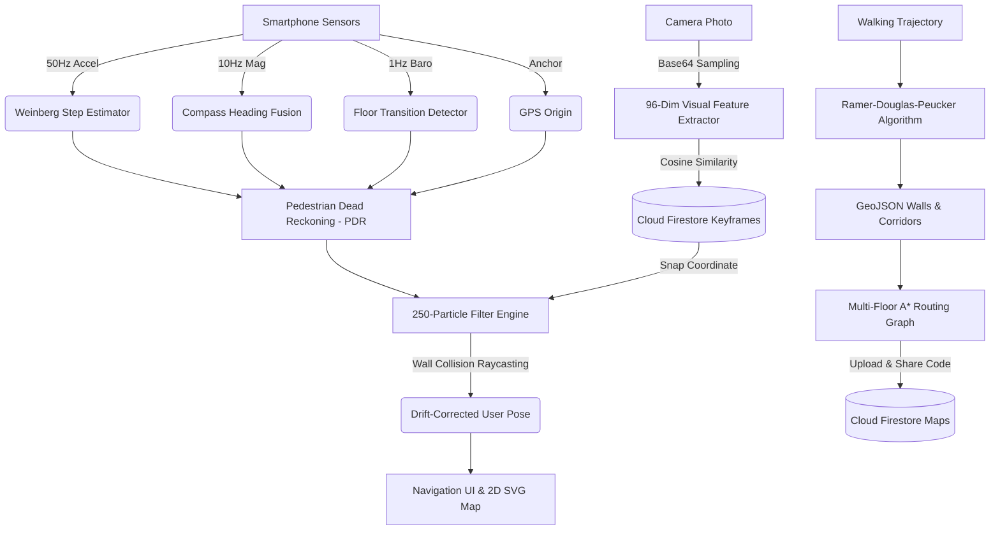

# 🧭 Indoor Navigator — Zero-Hardware Indoor Navigation & Mapping System

[](https://reactnative.dev/)
[](https://expo.dev/)
[](https://firebase.google.com/)
[](LICENSE)

> **Map any building once by simply walking through it, and navigate forever.**
> **Zero BLE Beacons · Zero UWB Tags · Zero QR Codes · 100% Free Tier Infrastructure.**

---

## 🌟 Highlights

- 🚀 **Zero External Hardware**: Operates strictly using standard smartphone IMU sensors (Accelerometer, Magnetometer, Barometer) + GPS anchor. No beacons, routers, or QR codes to install or maintain.
- 🚶 **Instant Map Creation**: Walk through your building once while holding the phone. The app records your trajectory, simplifies corridors via the Ramer-Douglas-Peucker algorithm, and generates a navigable multi-floor vector floor plan automatically.
- 📍 **One-Touch POI Pinning**: Drop named pins (Rooms, Labs, Washrooms, Stairs, Elevators) directly along your walking trail with one tap.
- 🎯 **Map-Constrained Particle Filter**: 250-particle Monte Carlo filter with real-time raycasting collision detection prevents user location drift through walls.
- 🧭 **Multi-Floor A* Pathfinding**: Turn-by-turn navigation engine with intuitive directional instructions (`⬆️ Straight`, `↗️ Turn Right`, `🪜 Take Stairs to Floor 2`, `🛗 Take Elevator`).
- 📸 **Visual Re-Localization (Optional)**: Capture a photo of your surroundings to instantly re-anchor your position using 96-dimensional color-spatial feature vectors and cosine similarity matching against saved cloud keyframes.
- ☁️ **Cloud Sync & Instant Sharing**: 6-digit sharing codes allow any visitor to load a building's map in seconds without scanning external markers.

---

## 📐 System Architecture



---

## 📱 App Screens & User Flow

| Screen | Purpose & Functionality |
|---|---|
| **1. Permission Onboarding** | One-shot permission requester on first launch (GPS, Camera, Motion, Storage). Caches status in AsyncStorage and never prompts again. |
| **2. Home Dashboard** | Quick actions for **"Create Map"**, **"Join by 6-Digit Code"**, and a searchable list of available cloud building maps. |
| **3. Live Walk Recording** | Real-time SVG canvas displaying the user's live trail, current floor indicator, GPS anchor status, and floating `+ Add Place` button. |
| **4. Map Generation** | Automated 5-step pipeline: Trajectory fusion → Corridor skeletonization → Navigation graph construction → Keyframe indexing → Cloud publishing. |
| **5. 2D Navigation View** | Interactive SVG floor plan with pulsing blue user dot, live animated A* route line, POI search drawer, floor switcher, and turn-by-turn banner. |
| **6. Visual Re-Localization** | Camera & gallery photo matcher that queries cloud keyframes to snap the user's location back onto the map if tracking is lost. |

---

## 🛠️ Technology Stack

| Layer | Technologies Used |
|---|---|
| **Framework** | [React Native 0.78](https://reactnative.dev/) with [Expo SDK 57](https://expo.dev/) |
| **Language** | JavaScript (ES6+ / Node.js) |
| **Navigation** | [React Navigation 6](https://reactnavigation.org/) (Stack & Safe Area Context) |
| **Graphics & Rendering** | [React Native SVG](https://github.com/software-mansion/react-native-svg) for 60fps vector floor plans |
| **Sensors & Hardware** | `expo-sensors` (Accelerometer, Magnetometer, Barometer), `expo-location`, `expo-camera`, `expo-image-picker` |
| **State & Storage** | `@react-native-async-storage/async-storage` |
| **Backend & Cloud** | [Google Firebase / Cloud Firestore](https://firebase.google.com/) (100% Spark Free Tier) |
| **Build & CI/CD** | [Expo Application Services (EAS Build)](https://expo.dev/eas) |

> 📖 **For complete algorithmic breakdowns, Weinberg formula details, Particle Filter math, and Firestore schemas, see [TECH_STACK.md](TECH_STACK.md).**

---

## 🚀 Quick Start & Installation

### Prerequisites
- [Node.js](https://nodejs.org/) (v18 or higher recommended)
- [Git](https://git-scm.com/)
- [Expo CLI & EAS CLI](https://docs.expo.dev/get-started/installation/):
  ```bash
  npm install -g eas-cli expo-cli
  ```

### 1. Clone the Repository
```bash
git clone https://github.com/aditi-malviya666/Indoor_navigation.git
cd Indoor_navigation
```

### 2. Install Dependencies
```bash
npm install
```

### 3. Configure Firebase
Update `src/firebase/config.js` with your Firebase project credentials:
```javascript
export const firebaseConfig = {
  apiKey: "YOUR_API_KEY",
  authDomain: "YOUR_PROJECT_ID.firebaseapp.com",
  projectId: "YOUR_PROJECT_ID",
  storageBucket: "YOUR_PROJECT_ID.firebasestorage.app",
  messagingSenderId: "YOUR_SENDER_ID",
  appId: "YOUR_APP_ID"
};
```

### 4. Run Live in Development (Expo Go)
```bash
npx expo start
```
- Open **Expo Go** on your physical Android/iOS phone and scan the terminal QR code to test with real hardware sensors!

---

## 📦 Building the Standalone Release APK

To build a standalone installable Android APK without compiling native C++ toolchains locally:

```bash
# 1. Authenticate with your free Expo account
eas login

# 2. Trigger the cloud APK build
eas build --platform android --profile preview
```

The cloud builder will package the application and provide a direct `.apk` download link upon completion.

---

## 📂 Project Structure

```
IndoorNavApp/
├── App.js                         # Root navigation container & screen registry
├── app.json                       # Expo configuration & permission declarations
├── eas.json                       # EAS build profiles (preview APK / production bundle)
├── package.json                   # Project dependencies & scripts
├── TECH_STACK.md                  # Comprehensive engineering & mathematical specification
├── assets/                        # App icons, splash screens, and adaptive assets
└── src/
    ├── creator/
    │   └── MapGenerator.js        # Trajectory simplification (RDP), wall inference, GeoJSON
    ├── engine/
    │   ├── sensorEngine.js        # Weinberg step counting, magnetometer heading, barometer floor detection
    │   ├── particleFilter.js      # 250-particle Monte Carlo filter with raycasting wall constraints
    │   ├── router.js              # Multi-floor A* pathfinder & turn instruction generator
    │   └── relocalization.js      # 96-dim image feature extractor & cosine similarity matcher
    ├── firebase/
    │   ├── config.js              # Firebase app initialization
    │   └── mapService.js          # Firestore CRUD operations, map sharing, keyframe storage
    ├── screens/
    │   ├── PermissionScreen.js    # Single-shot permission onboarding screen
    │   ├── HomeScreen.js          # Dashboard (Create, Join by Code, Available Maps)
    │   ├── RecordingScreen.js     # Live walk trajectory mapping & POI pin placer
    │   ├── MapGenerationScreen.js # Post-recording pipeline & cloud publishing
    │   ├── NavigationScreen.js    # 2D SVG floor plan, blue dot tracking, A* path navigation
    │   └── RelocalizationScreen.js# Visual camera re-localization capture UI
    └── utils/
        └── permissions.js         # Sequential permission requester & AsyncStorage caching
```

---

## 📜 License

This project is licensed under the MIT License — see the [LICENSE](LICENSE) file for details.
